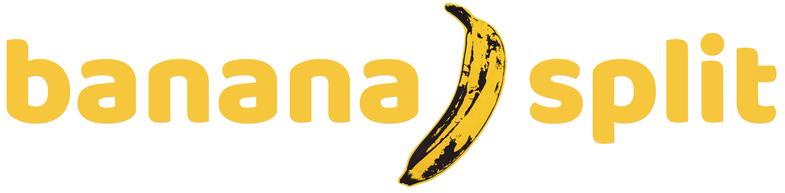

<p align="center">
  
</p>

# Banana/Split Server

Banana/Split is a fast paced game where you can battle with others creating words in a crossword fashion with a shared bunch of tiles. Each player has their own board and has to keep their spelling in check! A winner ends the game when all tiles are used from the bunch and players tile.

## Screenshots

<p align="center">
  
</p>

## Recommended
1. [Client Repo](https://github.com/krista-p/BananaSplit---Client) for front end

## Getting started with Server

1. Clone the repo

```
git clone https://github.com/Villux-NV/BananaSplit---Server.git
```

2. Install dependencies for server

```
npm install
```


3. Start development server for server

```
npm start
```

## Tech Stack

Server
- [Express](https://expressjs.com/) - Minimalist web framework for Node.js
- [Socket.io](https://socket.io/) - Library that enables real-time, bidirectional and event-based communication between the crowser and the server.
- [Mongoose](https://sequelize.org/) - Schema based solution to model application data for MongoDB.
- [MongoDB Atlas](https://www.mongodb.com/cloud/atlas) - Document-based, global cloud database service.

Client
- [React](https://reactjs.org/) - Front end library for building user interfaces
- [Next.js](https://nextjs.org/) - React framework for production
- [Firebase](https://firebase.google.com/) - Auth - Authenticate and manage users
- [TailwindCSS](https://tailwindcss.com/) - Utility-first CSS framework that can be composed to build any design, directly in the markup.
## Author

Krista Polikaitis - [Github](https://github.com/krista-p) - [LinkedIn](https://www.linkedin.com/in/krista-polikaitis/)
Derek Pizzolatto - [Github](https://github.com/chuck517) - [LinkedIn]()
Nick Villarreal - [Github](https://github.com/Villux-NV) - [LinkedIn](https://www.linkedin.com/in/nick-villarreal/)
Ben Krapivsky - [Github](https://github.com/Benkr)

## License

This project is licensed under the MIT License.
